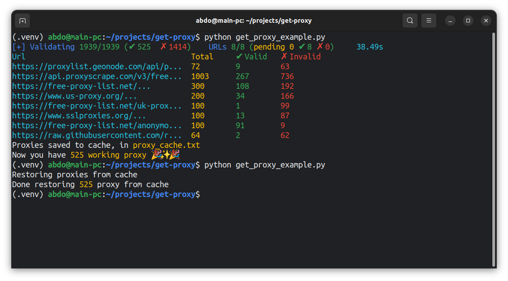

# أهلا وسهلا 👋

**What you will find here**: Unlimited collecting, validating, and caching free proxies. Collect form any endpoints includes: Text APIs, JSON APIs, or web pages, by simply adding URLs to the **proxy_sources.txt** file, Automatically handle collecting (scraping) validation, and caching. All this done very fast ✨

<p align="center">
  
</p>

## Features

We support **HTTP**, **HTTPS** proxies for validating (soon Socks4 & 5)

- ✨ **Unique IP!**: Ensure only proxies with unique IP addresses are returned.

- ⚡ **Asynchronous Power**: Asynchronously scrape URLs and validate proxies simultaneously, which will result in a very fast processing time 🚀.

- 🧹 **Scraping & Collect**: Extract proxies from URLs listed in proxy_source.txt using regular expressions for Webpages, JSON, and Text content.

- ✅ **Validating**: Validate proxies concurrently. We don't wait for all URLs to finish; validation happens as soon as each proxy is ready 💪.

- 💾 **Caching**: Optionally cache valid proxies and set a duration for automatic revalidation.

- 🐞 **Monitoring**: Track runtime details, including valid/invalid proxies, scraping status, source-specific proxy counts, and errors.

## Table Of Content

- [Examples](#examples-)
- [Use ProxyConfig](#use-proxyconfig)
- [Supported Content Types](#supported-content-types)
- [JSON APIs](#json-apis)
- [How To Use It](#how-to-use-it)
- [Config](#config-)
- [Options](#options)
- [TO-DO List](#to-do-list-)

## Examples 💡

Here's basics example without any options or configuration:

```py
import asyncio
from get_proxy import ProxyFetcher  # import the module


async def main():
  async with ProxyFetcher() as proxy_fetcher:
      valid_proxies = await proxy_fetcher.get_valid_proxies()
      # process proxies as you want
      print(valid_proxies)


asyncio.run(main())
```

### Use ProxyConfig():

Lets enable proxy caching, and set cache duration to 5m.

So, proxies will reuse as long the cache is valid, else will revalidate it.

```py
import asyncio
from get_proxy import ProxyFetcher, ProxyConfig


async def main():
    config = ProxyConfig(
        cache_enabled=True,
        enforce_unique_ip=False,
        cache_duration_minutes=5,
    )
    proxy_fetcher = ProxyFetcher(config)
    proxies = await proxy_fetcher.get_valid_proxies()
    print(proxies)

    # after end!
    await proxy_fetcher.close()


if __name__ == "__main__":
    asyncio.run(main())
```

## Supported Content Types

We handle various types of content: Webpages, JSON APIs, and Text APIs.

### Webpages

- [https://free-proxy-list.net/](https://free-proxy-list.net/)
- [https://www.sslproxies.org/](https://www.sslproxies.org/)

### Text APIs

- [https://api.proxyscrape.com/v3/free-proxy-list/get?request=displayproxies&protocol=http&proxy_format=protocolipport&format=text&timeout=20000](https://api.proxyscrape.com/v3/free-proxy-list/get?request=displayproxies&protocol=http&proxy_format=protocolipport&format=text&timeout=20000)
- [https://spys.me/proxy.txt](https://spys.me/proxy.txt)

### JSON APIs

JSON sources might provide IP and port numbers in different fields. Here’s how to configure them:

1. **Add a URL to your proxy resources file.**
2. **Add the following after the URL: `json=true&ip=<ip_field>&port=<port_field>`**
   - Replace `<ip_field>` with the key for the IP address.
   - Replace `<port_field>` with the key for the port number.
   - Make sure there is a space between the URL and the parameters.

**Example:**

If your JSON response looks like this:

```json
[
  {
    "IP": "314.235.43.2",
    "PORT": "80",
    "foo": "bar"
  },
  {"..."},
]
```

And your URL is `http://example.com/api/free-proxy?format=json`, you should write:

```text
http://example.com/api/free-proxy?format=json json=true&ip=IP&port=PORT
```

> **INFO:** Ensure there is a space between the URL and the parameters.

## How To Use It:

- **Requirements**📋:

  - aiohttp

- Clone repo, and navigate to working director:

```bash
git clone https://github.com/abdelrahman-mh/get-proxy
cd get-proxy
```

- Setup working directory:

```bash
# create python venv (optional!) and activate it
python3 -m venv .venv && source .venv/bin/activate

# install requirement
pip install -r requirements.txt
```

- Try it!:

```bash
python3 get_proxy.py
```

## Reference 📚

**`ProxyFetcher()`**:

```python
ProxyFetcher(config=ProxyConfig())
```

**`ProxyConfig()`**:

```python
ProxyConfig(
    prefix="http://",
    user_agent="Mozil...",
    ip_check_api="http://httpbin.org/ip",
    request_timeout=15,
    retry=0,
    concurrency_limit=500,
    proxy_sources_file="proxy_sources.txt",
    proxy_cache_file="proxy_cache.txt",
    cache_enabled=False,
    cache_duration_minutes=20,
    enforce_unique_ip=True,
    strict_x_forwarded_for=False
)
```

**Options**

- **`prefix`**: Proxy URL prefix (default: `"http://"`).
- **`user_agent`**: User-agent string (default: `"Mozil..."`).
- **`ip_check_api`**: API for public IP check and proxy validation (default: `"http://httpbin.org/ip"`).
- **`request_timeout`**: Timeout for proxy validity checks (default: `15` seconds).
- **`retry`**: Number of retries for failed proxy requests (default: `0`).
- **`concurrency_limit`**: Maximum concurrent proxy validation requests (default: `500`).
- **`proxy_sources_file`**: File containing proxy source URLs (default: `"proxy_sources.txt"`).
- **`proxy_cache_file`**: File for storing cached proxies (default: `"proxy_cache.txt"`).
- **`cache_enabled`**: Whether to enable caching (default: `False`).
- **`cache_duration_minutes`**: Duration for caching proxies (default: `20` minutes).
- **`enforce_unique_ip`**: Ensure each proxy has a unique IP (default: `True`).
- **`strict_x_forwarded_for`**: Enforce strict handling of `X-Forwarded-For` headers, there's some proxies not really hide your IP! (default: `False`).

## For Developers 🛠️

`PRs` are welcoming!

### To-Do List 📝:

- [ ] Add an option to limit the number of working proxies that returns.
- [ ] **Design Patterns**:
  - Use **caching** to store configurations during initialization, avoiding repeated checks at runtime.
  - Consider patterns like **Strategy** or **Factory** to manage varying behaviors based on configuration.
  - Implement a method for handling proxy limits and use **asyncio.as_completed()** for processing results as they finish, instead of **asyncio.gather()**.
  - Apply these patterns to improve configuration handling for options like **enforce_unique_ip** and **cache_enabled**.
- [ ] **Socks 4 & 5**: Add support for Socks4 and Socks5 proxies.
- [ ] Separate proxy **scraping** and **validating**
- [ ] Add type annotations and hints to the code.
